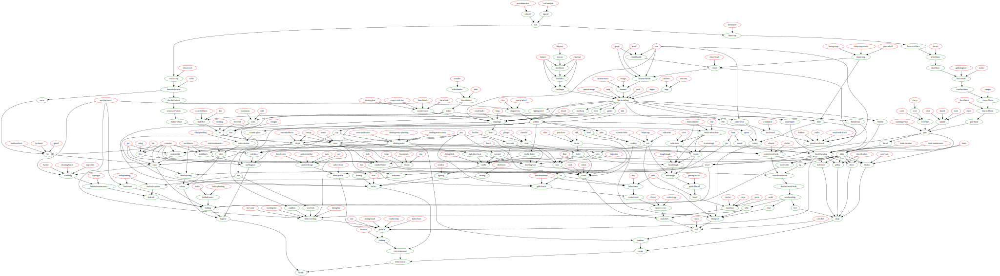

In 2015, Narendra Modi inaugurated the first [National Handloom day](https://www.mygov.in/campaigns/national-handloom-day/) in India.
Celebrating more than the implement itself, the day commemorates August 7, 1905, when a formal proclamation in the Calcutta Town Hall was made to curb foreign goods in favour of domestic production, ostensibly as a response to the British partition of the Bengal.
The proclamation was a major event in the the Swadeshi (स्व: "self", देश: "country") movement, and pointed at a more general truth: as long as one is dependent on another, correspondingly one is dependent on the other's interests.
The handloom and spinning-wheel have come to be symbols of self-sufficiency in India, with the charkha spinning-wheel featuring on the national flag (🇮🇳).

Social desires for self-sufficiency have seen both support and opposition across history, as well as economic and  political ideologies.
Autarky (*αὐτο*: "self", *ἀρκέω*: "to suffice") is the standard term used for the concept.
Examples of historical societies consciously adopting autarky ideals include many post-Bronze-Age-Collapse Greek states, Agriculturalist Chinese in the Warring States Periods[@geaham1979nungchia], the Bagaudae[@leon1996bagaudes], and [European medieval communes](https://en.wikisource.org/wiki/1911_Encyclop%C3%A6dia_Britannica/Commune,_Medieval).
Autarky is a member of the interesting but slim set of political ideals where the Khmer Rouge and Italian Fascism sit in the same corner, in opposition to Trotskyism and Neoliberalism.
In present times, the greatest opposition to autarky tends to stem from representatives of core countries that benefit most from globalisation.

Autarky itself varies in it's application.
In the most extreme case, there is the closed economy, with no trade inside or out.
Conversely, self-sufficiency need not be conflated with isolationism, and international trade may still take place with a country following autarky ideals -- the policies of the state are simply be such that it is capable of meeting it's needs internally.

Self-sufficiency is also quite often pursued at an individual level, for reasons of virtue or pragmatism.
[Homesteading](https://homesteading.com/) is a lifestyle that continues today, and was most associated with frontier settlers, who by necessity required a high degree of self-reliance.
Related movements include the [Back-to-the-Land movement](https://en.wikipedia.org/wiki/Back-to-the-land_movement), [Survivalism](https://offgridsurvival.com/), and [Anarcho-Primitivism](https://theanarchistlibrary.org/library/john-moore-a-primitivist-primer).
It appears that there has been particularly renewed interest in individual-level self-sufficiency in very recent years, following breakdowns in supply chains, fear of the COVID-19 pandemic and a rise in authoritarianism amongst governments worldwide.
The "sourdough craze" may be seen as one manifestation of the individual-level drive for self-sufficiency, coupled with the greater time at home experienced by many during the lockdowns. 

What can be seen of this ideal of self-sufficiency?
Frankly, failure all around.
India's poor bear the brunt of it's major dependence on the system of international trade, and the home sourdough bakers are still out of toilet paper.
A significant portion of the Back-to-the-Landers went back to the cities, having over-romanticised rural life, and most Survivalists won't survive after they finish their 10-year rations, their solar panels break down, and there's no one to deliver a replacement.
Failure on the state-level is exceedingly complex, with many differing perspectives.
Blame economists, mostly.
At an individual level it seems to come down to a continued dependence in too many critical areas, and attempting to take on too much work as individuals.
Herein is the irony of personal self-sufficiency: Attempting to do everything as an individual leads to failure, thereby leading to dependence on a more fragile large-scale system than one that could have been set up at a local scale originally.
No man is an island, and it would be better in these cases to interpret the "self" in "self-sufficiency" as the social self.
Most individuals would have had far greater success in self-sufficiency if the tasks of a resiliant community were actually spread among a community.

A key aspect to the success of self-sufficiency, at both an individual and national level, is a reduction in social complexity.
Solar panels do not play a part in this - the complexity to manufacture and supply such an assembly, as well as all of the electrical equipment that it powers, is far beyond any acceptable notion of self-sufficiency - certainly more complex than a [pencil](https://fee.org/resources/i-pencil/).
Social complexity is one of the key drivers for this desire of self-sufficiency, and continued patronisation of inherently complex networks serves to perfectly counter the desired escape from a system perceived to collapse.
Improperly managed complexity always leads to greater complexity, as increasingly complex solutions are required to fill in the holes created by an already complex system.
The following is a misquote removed from it's original context, but can be applied most vigorously to any overcomplex system:

> You wanted a banana but what you got was a gorilla holding the banana and the entire jungle.[@seibel2009-ja]

The perceptions of collapse as mentioned above are also worth considering, contra system-proponents.
As written above, there have already been supply chain breakdowns, though these have been far milder than a zombie apocalypse scenario.
Tainter describes the social collapses that have occurred many times throughout history as having common causes, most generally due to a social overreach in complexity, going past the point of diminishing returns.
His 1988 book, *The Collapse of Complex Societies*, has many interesting discussions and graphs, including an analysis of modern societies, with one graph of particular amusement to me being the rising ratio of administrative staff to researchers and lecturers at Universities in the US.

> Collapse then is not a fall to some primordial chaos, but a return to the normal human condition of lower complexity. The notion that collapse is uniformly a catastrophe is contradicted, moreover, by the present theory. To the extent that collapse is due to declining marginal returns on investment in complexity, it is an economizing process.  It occurs when it becomes necessary to restore the marginal return on organizational investment to a more favorable level. To a population that is receiving little return on the cost of supporting complexity, the loss of that complexity brings economic, and perhaps administrative, gains. [@tainter1988collapse]

Beyond perceived weakening structural integrity, an attempt to escape interactions with the worsening social behaviour in conditions associated with dependency is common amongst those desiring self-sufficiency.
Calhoun demonstrated the collapse in normal behaviour among rats living in overcrowded spaces with unlimited access to necessities of food and water, described as the *Behavioral Sink*.
While there are obvious limitations to blind application of rat studies to humans, the similarities in social breakdown are glaring, if not to the point of cannibalism as per the rats.
Based on primate studies, Dunbar went further and provided a specific limit to the number of social relationships people can have, at around 150.
While this number has had some criticism, the central point of cognitive limits to social relationship size remains.
Social complexity is defined by more than just social relationships but there is strong input from the latter.

> The consequences of the behavioral pathology we observed were most apparent among the females. Many were unable to carry pregnancy to full term or to survive delivery of their litters if they did. An even greater number, after successfully giving birth, fell short in their maternal functions. Among the males the behavior disturbances ranged from sexual deviation to cannibalism and from frenetic overactivity to a pathological withdrawal from which individuals would emerge to eat, drink and move about only when other members of the community were asleep. The social organization of the animals showed equal disruption. [@calhoun1962population]

Creation of necessities from scratch is the crux of self-sufficiency.
This entails a reduction in social complexity, resilience, and forces recognition that no one individual is capable of sufficiency alone.
A level of technological development appropriate to the circumstances is likely to have further positive economic, social, and ecological effects.
While complexity and sufficiency are not synonymous, they are hardly orthogonal concepts.
Complexity limits the capacity for self-sufficiency, by creating too many dependencies to keep track of -- the bane of many a great software project.

> Everywhere we remain unfree and chained to technology, whether we passionately affirm or deny it. But we are delivered over to it in the worst possible way when we regard it as something neutral; for this conception of it, to which today we particularly like to do homage, makes us utterly blind to the essence of technology[@heidegger2013tech]

The greatest driver of complexity in modern times is technological progress, so opposition to complexity entails some degree of opposition to technological progress.
Resistance to technological progress has come from many different quarters and is worth examining in further detail.
Like Autarky, it cuts across political spectra and has had many different manifestations over history.
Individuals in modern times supporting technological limitations include [Abbey](http://www.abbeyweb.net/), [Ellul](https://ellul.org/), [Gandhi](https://www.gandhiheritageportal.org/mahatma-gandhi-books/the-story-of-my-experiments-with-truth-volume-one), [Heidegger](https://www.heidegger-gesellschaft.de/), [Linkola](http://www.penttilinkola.com/), and [Mishima](https://www.mishimayukio.jp/).
Perhaps the most extreme example is that of Kaczynski, "the Unabomber", who engaged in a bombing campaign to promote his anti-tech manifesto, [*Industrial Society and it's Future*](https://archive.nytimes.com/www.nytimes.com/library/national/unabom-manifesto-1.html), who had some surprising intellectual support from none other than Bill Joy, the creator of [the world's greatest text editor](https://man.openbsd.org/vi), among others.
Opposition to technological progress meets itself with opposition, which often takes rather crude and lazy forms (though at least doesn't usually include bombing campaigns), with heavy reliance on the "luddite" pejorative, and a rather weak argument known as the "Luddite Fallacy".

The "Luddite Fallacy" is that concern over technological unemployment fails to account for compensation effects.
The "Luddite Fallacy"-Fallacy is herein defined as not only a strawman for the vast majority of those concerned with technological unemployment, but a failure to take into consideration the individual circumstances for concern, including an excessively dismissive approach to the unintended consequences of technological change.

> The Industrial Revolution and its consequences have been a disaster for the human race. They have greatly increased the life-expectancy of those of us who live in "advanced" countries, but they have destabilized society, have made life unfulfilling, have subjected human beings to indignities, have led to widespread psychological suffering (in the Third World to physical suffering as well) and have inflicted severe damage on the natural world.[@kaczynski2019tech]

The actual Luddites of the 19th century, who destroyed industrial textile machinery, were not necessarily concerned with a total state of unemployment by machines.
Many were self-employed, working as artisans in craft at their home workshops.
They rallied against their own unemployment brought about by industrialisation and it's attendant distancing of the means of production, as well as the changing nature of work, a more subjective measure that isn't accounted for in standard econometric models.
They validly feared the increased vulnerability that comes with economic displacement.
Similar movements included the Swing Riots against agricultural mechanisation.
Their only fallacy was underestimation of just how bad life could get for them following technological progress.
An eloquent illustration of the poverty of spiritual life among those centred in the industrial revolution is given by Carlyle's Condition of England Question, elucidated in [Signs of the Times](https://archive.org/details/s5id13297330/page/490/mode/2up), and [Chartism](https://archive.org/details/chartism00carlrich).
Most of the horrors of employment in service to Victorian Industry were only corrected in the mid Twentieth Century, following the Second World War (itself dependent on industrialisation).

Interestingly, only in the past several years has there been any meaningful movement to a remote style of work that was more common to pre-industrial times.
This has also been coupled with a renewed opposition to technological unemployment.
Once again, those most vulnerable to this insidious form of unemployment are typically shrugged off -- "learn to code" -- by those most insulated from technological change.

A self-sufficient society with technological limitations doesn't dictate a return or replica of entire previous systems, as at the very least they clearly had the weakness in them to birth the current one.
There is plenty to oppose in previous systems, from economic, political and social perspectives.

For a self-sufficient society, one in which necessities are made from scratch, it must itself be designed from scratch.
Naturally, inspiration can be taken from history, but it is not to be a reactionary return to an idealised past.

The thought experiment of construction of society from scratch enjoys a rich history, stretching back to the most eminent work of political philosophy, Plato's [*Republic*](https://www.gutenberg.org/ebooks/1497).
A notable component of the text is a detailed investigation into the nature of justice by way of dialectically teasing out an imagined self-contained society, starting with farmers, and adding cobblers and the like to meet necessities.
Requiring luxuries and cakes, the population is then branched out to meet such desires.

> A State, I said, arises, as I conceive, out of the needs of mankind; no one is self-sufficing, but all of us have many wants. Can any other origin of a State be imagined?
> 
> ...
>
> Then, I said, let us begin and create in idea a State; and yet the true creator is necessity, who is the mother of our invention.
>
> Of course, he replied.
>
> Now the first and greatest of necessities is food, which is the condition of life and existence.
>
> Certainly.
>
> The second is a dwelling, and the third clothing and the like.
> 
> True.
>
> And now let us see how our city will be able to supply this great demand: We may suppose that one man is a husbandman, another a builder, some one else a weaver--shall we add to them a shoemaker, or perhaps some other purveyor to our bodily wants?
>
> ...
>
> Yes, Socrates, he said, and if you were providing for a city of pigs, how else would you feed the beasts?
>
> But what would you have, Glaucon? I replied.
> 
> Why, he said, you should give them the ordinary conveniences of life. People who are to be comfortable are accustomed to lie on sofas, and dine off tables, and they should have sauces and sweets in the modern style.[@plato2007republic]

The tradition of building from scratch has continued in possibly the most artful medium -- the video game.
[Minecraft](https://minecraft.fandom.com/wiki/Minecraft_Wiki) -- indisputibly the greatest video game of all time, as well as best-selling --  has as one of it's core mechanics the construction of tools, items and structures from scratch.
Beyond the Minecraft clones, [Little Alchemy](http://littlealchemy.com/) is another unique game of combining raw ingredients to compose others, building, again, from scratch.

To the economically minded, a greater case for the "from-scratch" philosphy is given in the microeconomic concept of [vertical integration](https://en.wikipedia.org/wiki/Vertical_integration).
While not always appropriate, it is in many cases advantageous to vertically integrate - my argument is that actual communities gain in nearly every respect when vertically integrating themselves with their subsistence.
A fun example of commercial vertical integration, which I had only recently learned from [Jonty](https://jontycg.github.io/), is that of [Rolex, as presented by Forbes](https://www.forbes.com/sites/arieladams/2013/12/05/inside-rolex-understanding-the-worlds-most-impressive-watch-maker/), who own suprisingly many components leading to manufacture of their watches.

My vision of a "from-scratch" way of living is given by a listing of prerequisites.
In this, I demand more than [a life just-worth living](https://plato.stanford.edu/entries/repugnant-conclusion/) - like Glaucon, I insist on sweets.
Everything has it's requirements however, and this insistence on sweets must be tempered with the aversion to take a society away from self-sufficiency and into over-complexity.
I have organised my listing of prerequisites as a [makefile](https://man.openbsd.org/make), which can be conceptualised as a directed graph, with a topological sorting being an important operation to demonstrate both a lack of complexity as well as an ability to service all base requirements, which are given as leaf nodes.
The makefile is available at [the prerequisite makefile on GitHub](https://github.com/jcai849/jcai849.github.io/blob/master/docs/life-prereq.mk) and [the prerequisite makefile on this server](life-prereq.mk).
A visualisation of the graph is given in [@fig:life-prereq].

The listing has taken a life of it's own, creating it's own principles.

For example, like elements are gathered under abstractions, lest the graph have more arcs than vertices.
Construction has proceeded through filling out branches with their prerequisite leaves, then recursively repeating on those leaves, occasionally going back to prune or redo branches based on new information.
Each line in the listing is effectively a *mise en place* of the minimal elements required for the direct creation of a particular target element.

When presented with the graph, ironically the first response is that it is complex.
This is correct.
The enemy is not complexity, but an inappropriate level of complexity.
Neither too constrained and therefore unpleasant to work with, and not over-complex and unwieldy.
Clearly there is a capacity for some complexity.
Best to take the complexity that struggles to supply a good life, get that completely managed (as shown here), and use the surplus capacity for complexity to solve health and space travel.

](life-prereq.svg){#fig:life-prereq}

# References
