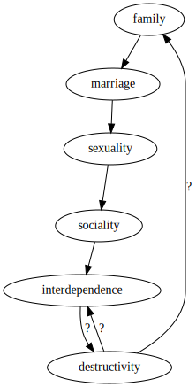

One of the greatest forms of social capital and source of human meaning lies with the construct known as the family.
This element of social order is severely eroded, having been reduced in the common understanding to refer only to nuclear family, and faces further deconstruction beyond that.

A significant wedge in the crevice that is the idea of family is likely found in a lack of general social concern for marriage.

This is due in turn to the non-concern over sexuality.
Sexuality, rather than being afforded tight regulation, is simultaneously everywhere and nowhere.
Intercourse is just another act, but one that holds broad public taboo.
Public reference to sexuality is strictly indirect.
In recent decades, the gay pride movement has provided some of the most powerful arguments in support of the institution of marriage - yet this movement distances itself publicly from explicit sexuality, with proponents placing most of their emphasis on love, which is ironically something which has not had anywhere near as much social censure as actual sexuality.
Perhaps this is an exploitation of "love" being such an overloaded term in English compared with, e.g. Attic Greek in [ἀγάπη](https://en.wikipedia.org/wiki/Agape), [ἔρως](https://en.wikipedia.org/wiki/Eros_(concept)), [φιλία](https://en.wikipedia.org/wiki/Philia), [στοργή](https://en.wikipedia.org/wiki/Storge), [φιλαυτία](https://en.wikipedia.org/wiki/Self-love), [ξενία](https://en.wikipedia.org/wiki/Xenia_(Greek)), etc..
Privately, sexuality in general pervades far more than is publicly referenced, between daily rituals of "swiping right" and the "private tab".

The lack of concern for sexuality is grounded in a denial of it's formation of social relations, which ultimately stems from a lack of concern for social relations in general.
Social relations of friendship in particular sees friends as just another form of entertainment, possibly becoming outmoded by newer forms of pleasure.

This is due to a lack of interdependence between people in situ, where no "bonds" exist to hold them together as a physical community.
Of course, another irony is that people are more dependent than ever, just not on anyone that they know personally.

My breaking-off point is to question where such local independence stems from.
Was it truly a general social desire for independence?
If so, in what did this desire originate? Did it "just happen", as a degenerate Nash equilibrium of impersonal economic forces?

As used above, "bond" may suggest some answer, with all of the varied denotations including a literal strip that fastens, a legal covenant, a certificate of debt, or since the late 1960's a more abstract connection between people.
Most of these meanings have strongly negative associations, though their ends may be seen as positive.
The formation of attitudes around social bonds reflects this, with Etymonline producing an interesting description:

> In the more despotic Norway and Denmark, bo'ndi became a word of contempt, denoting the common low people. ... In the Icelandic Commonwealth the word has a good sense, and is often used of the foremost men ...." [OED]. The sense of the noun deteriorated in English after the Conquest and the rise of the feudal system, from "free farmer" to "serf, slave" (c. 1300) and the word became associated with unrelated bond (n.) and bound (adj.1).

Irrespectively, this discussion of a single word serves only as a potential hint, and the above questions regarding the increased direct social independence remain in serious need of answer.

Looking at truly broken communities may give a more illustrative answer, as an example of the absurdem reached further along the trajectory of familial and social breakdown.
In Hillbilly Elegy[@vance2016], J.D. Vance relates the cultural dissolution of the Scots-Irish "hillbillies" who compose a large share of the American Appalachian population.
The story of his own family is offered as a characterisation of the destruction in the larger scale, and a remark from his sister is telling: "you just can't depend on people".
After families break down, their members become increasingly destructive to themselves and each other.
This is effectively the top-level problem that is being investigated in this very document.
Hillbilly Elegy implicitly ties the destruction rooted in familial breakdown as the cause of independence: after involvement with destructive people, greater independence from people is naturally sought, as depicted in [@fig:non-concern].
A vicious circularity entails.
More questions arise: how can such a cycle be broken and returned from? How can it be prevented?

{#fig:non-concern}

# References
