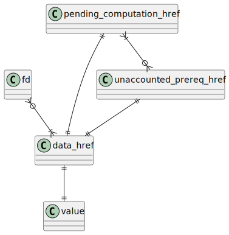
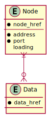
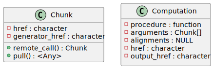
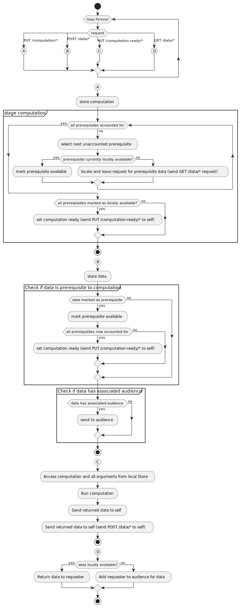

# Introduction

This is a report covering much of the architectural work that has been engaged in since the [previous report](concurrency.html).
The work entirely transforms the core of the project, being a full self-contained stack from the networking level in C upwards, with an entirely new infrastructure.
It was prompted by the failure to enable concurrency in R; this attempt at concurrency is elaborated upon in [An Exploration of Concurrency in R](concurrency.html).
Despite the failure of the attempt, concurrency is still absolutely essential for the system - without concurrency, we are left with exceptionally simplistic servers, and complex behaviour in the nodes will require an order of magnitude more complex programming constructs.
An example of even moderate complexity may be in the processing of a task that needs to be effectively paused until further inputs are available.
Without concurrency this is extremely difficult to represent, but the new system enables this.

The new system area consists of three discrete layers, with each higher layer building on the lower:

- _orcv_, a lower infrastructure layer that handles the network communications and base node data structures, as an asynchronous communicating event receiver.
- _largeRscale_, A middle layer that handles that defines chunks, nodes and their behaviour
- _largescaleR_, A higher level API layer that defines the distributed objects and allows for high-level operations to be quickly defined over the objects, and is what is publicly exposed to users as the standard API.

Previously, there was one single package, in the place of the top layer.
Beyond the infrastructural changes to enable concurrency, a side effect has been the removal of a central message queue, previously given by Redis.
Now, not entirely intentionally, each node has it's own message/event queue, creating a more peer-to-peer topology.
The level of encapsulation was also sufficient in the previous version that code written agains the top layer has required minimal changes to maintain functionality.

# Bottom Layer: _orcv_

The lowest layer is a self-contained package of mostly C descriptions of networking communication and thread-safe internal event queues.
Communications are the core of this package and the main actors given are the listener and receivers.
The listener is simply a standard `accept()`{.C}er that upon acceptance of a connection passes on the file descriptor to a thread pool of receivers by way of the thread-safe queue.
The receiver that picks up the connection in turn reads from it, passing on whatever message is received to a shared event queue, along with a file descriptor of the connection socket, in order to allow for direct responses to messages.

The event queue consists of a basic thread-safe queue complete with a file descriptor that has a byte written to it upon an `enqueue()`{.C}, and a byte read at a `dequeue()`{.C}.
The inclusion of a file descriptor allows for efficient multiplexing on the queue via `poll()`{.C}ing.

So orcv provides initial network communication capabilities, as well as event queues that can be monitored, with events themselves able to be replied to directly by way of their included file descriptor.
Much of the package structure is related to existing work by Urbanek, with much of the networking architecture taking direct inspiration from Stevens[@stevens1997network] 

# Middle Layer: _largeRscale_

The middle layer defines the nodes and interactions between them, using an emulated HTTP, with the lower orcv layer as its mechanism of communication.
The three nodes defined by this layer are the client, the worker, and the locator.

The client is the master node that the user interfaces with directly, and the main task of the client is to push individual chunks as data, to request remote calls on that data, and to pull the results of remote calls.
In order to push, remote compute, and pull, it connects to worker nodes, relaying the message for them to work on.
In order to connect to worker nodes, it has to know where they are located, given by their address and port.

Managing the knowledge of locations is the role of the locator service, which serves as a singular central database of addresses.
Existence as a node in the distributed system is synonymous with having a location stored in the locator service.
The locator service also performs the slightly orthogonal task of determining which chunks of data exist at what locations.

Worker nodes are the nodes that store data (chunks) and run computations upon them.
They respond to client requests, but importantly can communicate amongst themselves, particularly in the case of data being available on one worker node, with the data required for a computation taking place on a different worker node - the worker running the computation will request the data directly, thus functioning in a hybrid peer-to-peer fashion.
Communication among workers is dependent on the location service, in similar fashion to clients.

Both worker and locator nodes follow a similar architecture.
They both follow the same basic pattern of first initialising, then running some initialisation function and endlessly repeating a check for the next event and handling that event.
The check for the next incoming event, as well as any response to the event, is the point of connection with the lower orcv layer.
The nodes differ only in their core database schema, as well as the handlers associated with the HTTP requests sent to them as events.

The worker database schema is given in [@tbl:wstore;@tbl:wstage;@tbl:waudience] with an Entity Relationship Diagram given by [@fig:workerdb]

| data_href | value |
|-----------|-------|
| character | Any   |

Table: Worker Store Table {#tbl:wstore}


| unaccounted_prereq_href | pending_computation_href |
|-------------------------|--------------------------|
| character               | character                |

Table: Worker Stage Table {#tbl:wstage}


| fd      | data_href |
|---------|-----------|
| integer | character |

Table: Worker Audience Table {#tbl:waudience}


{#fig:workerdb}

The locator database schema is given in [@tbl:lnodes;@tbl:ldata] with an Entity Relationship Diagram given by [@fig:locatordb]


| node_href | address   | port    | loading |
|-----------|-----------|---------|---------|
| character | character | integer | integer |

Table: Locator Nodes Table {#tbl:lnodes}


| node_href | data_href |
|-----------|-----------|
| character | character |

Table: Locator Data Table {#tbl:ldata}


{#fig:locatordb}

The worker handlers are given by [@tbl:whandler]

| HTTP Request             | Handle                                                                                  |
|--------------------------|-----------------------------------------------------------------------------------------|
| POST /data/*             | Add given data to the Store (non-responding)                                            |
| GET /data/*              | Search Store for data; hold connection until available and send when available          |
| PUT /computation/*       | Add computation to Store and Stage, to check prerequisite availability (non-responding) |
| PUT /computation-ready/* | Computation declared ready; begin computation (non-responding)                          |

Table: Worker handlers for requests {#tbl:whandler}

The locator handlers are given by [@tbl:lhandler]

| HTTP Request | Handle                                                        |
|--------------|---------------------------------------------------------------|
| POST /node   | Add given connection to table of Nodes (non-responding)       |
| GET /nodes   | Respond with dump of Nodes table                              |
| POST /data/* | Add data href to given node in table of Data (non-responding) |
| GET /data/*  | Respond with table of Nodes where data resides                |

Table: Locator handlers for requests {#tbl:lhandler}

HTTP is used as the communication protocol, because HTTP provides a reasonable constraint on remote calls, and is fairly universal.
Actual HTTP is not used currently; rather, it is emulated with an R list composed of header and message body elements.

Chunks and computations on those chunks are represented as very simple S3 classes based on lists, with their structure given in [@fig:largerscale]

{#fig:largerscale}

Every chunk and computation has an identifier ("href" in HTTP-language) - this is a uuid that allows for unambiguous specification of objects within the system.
Chunks contain an additional identifier of their generating process, that is, the identifier of the computation that is is the result of.
Computations stored as data are typically a lot in a lot smaller than the data that results from them.
This implies that every single computation that takes place in the system can be stored as data and replicated across several notes far more simply than their resulting data.
What this leads to is that if a node unexpectedly crashes with some important data on it, the chunk referring to the data on that node maintains a reference to the generator of the data.
This generator will hopefully exist on another that is still live, and thus can the data can be regenerated.
Such regeneration is explored in more detail in the report, [Self-healing Data in Largerscale](recover.html)

## Worker operation in detail

An activity diagram demonstrating the main operation of the worker is given in [@fig:workerops].
This is seen in use in an example interaction in [@fig:sysinteract]

{#fig:workerops}

{#fig:sysinteract}

# Top Layer: _largescaleR_

The highest level layer is given by the largerscale package.
The only aspects considered by this layer are collections of data (taking the generic name of "Distributed Object") and operations on such collections.
The package builds on the middle layer, with no direct reference to the lowest layer at all.
Furthermore, nowhere in largerscale is there any notion of location, or indeed any addresses.
Being the main public interface, this layer also possesses the capacity to initialise everything in the distributed system - so it may initialise all of the workers and locator, and after that point, it can forget about locators and workers, with the middle layer taking care of such concerns.
The core provisions of this layer are the `DistributedObject`{.R} class, `read()`{.R} methods used to read in distributed data, `do.dcall()`{.R} to perform computations over distributed objects, and `emerge()`{.R} to pull and recombine distributed objects.

An illustrative example of such provisions follows.

In order to generate a distributed object, data has to be distributed across the network, and its simplest standard form is through reading existing data from disk.
This takes place through some read operation, for the sake of example a CSV scattered into shards across the machines in the network.
Using a `read.dcsv()`{.R} (`d` for distributed) call, a character vector of filepaths are supplied by the user, which are in turn scattered across the network to the worker nodes on the appropriate hosts.
Internally, this vector of filepaths is transformed into a distributed object, with this then being manipulated by the `do.dcall()`{.R} function which operates in a similar manner to the `do.call()`{.R} function that is standard in base R.
More specifically, it takes the name of a function as well as arguments to some function, returning the result of application of that function to the arguments.

Here a revealing example of layer division is shown: the largerscale middle layer handles how how the the the local vector of file names may be pushed.
Naively, they might just all be pushed to one single node but in fact largerscale keeps track of the loadings of each node and distributes the data evenly across the network.
This could be performed with any arbitrary strategy and there may be allowance in the future for the specification of distribution strategy.
The key point though is that such concerns are not dealt with at the top layer - the `push()`{.R} function from largerscale is relied upon to manage it itself.

Further operations may be performed on a distributed object through `do.dcall()`{.R}, and after some reduction (or not) a distributed object can be pulled back to the client/master node using an `emerge()`{.R}.
The `emerge()`{.R} is more complex than a `pull()`{.R}, in that multiple chunks must be pulled and stitched together using a `combine()`{.R} function.
The `combine()`{.R} function is generic and will behave differently depending on the class of chunks that are pulled.

Some basic methods are defined using combinations of the provided functions, such as various maths operations, summary operations and the like. 
For instance, `summary()`{.R} follows a basic pattern of running a distributed call over a distributed object to summarise each chunk on their corresponding nodes, and then emerging them, pulling them locally and running the some summary function on their  emerged values.
This works for transitive functions such as `min()`{.R} and `max()`{.R}, though isn't accurate for `median()`{.R} or other non-transitive functions.
This is effectively a map reduce operation and this is just one of many higher-level operations that is enabled through doing a distributed call and then pulling, then running some summary function over the implicitly combined emerged values.

As a demonstration of the power granted by the primitives given by this layer, the full implementation of Math and Summary methods for distributed objects is given in [@lst:mathsum]

```{#lst:mathsum .R caption="Math and Summary methods defined by largescaler primitives"}
Math.DistributedObject <- function(x, ...)
        do.dcall(.Generic, c(list(x=x), list(...)))

Summary.DistributedObject <- function(..., na.rm = FALSE) {
        mapped <- emerge(do.dcall(.Generic, c(list(...), list(na.rm=na.rm))))
        do.call(.Generic, c(list(mapped), list(na.rm=na.rm)))
}
```

# Next Steps

The next steps for this system include the handling of alignment, and recovery.
Both may take many different forms.

Alignment refers specifically to the management of a situation where multiple distributed objects are be operated over in the same computation, where each of them may have chunks of different lengths or varied number of chunks.
This is quite complex and will be a fairly significant task in itself to implement cleanly.
The original system had alignment before, however this was not entirely functional, and was the minimal required to get basic alignment working.
This can be built upon and used for comparison with the future alignment management. 

The next important piece for a serious distributed system is recovery from errors.
The resiliance of a system is essential where nodes may crash, but the system must continue to work. This can be focused upon at the distributed object level as well as potentially more, such as enabling a pure peer-to-peer topology, with the location service itself distributed.

# References
