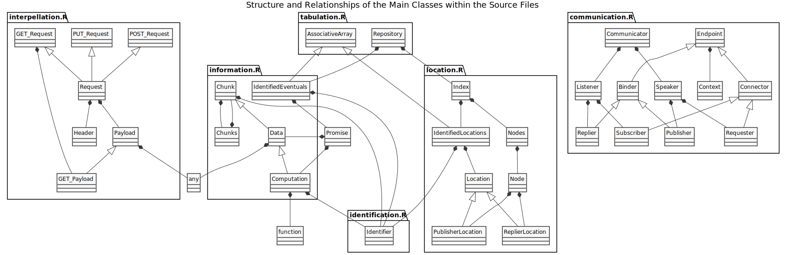
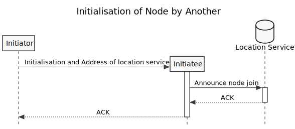
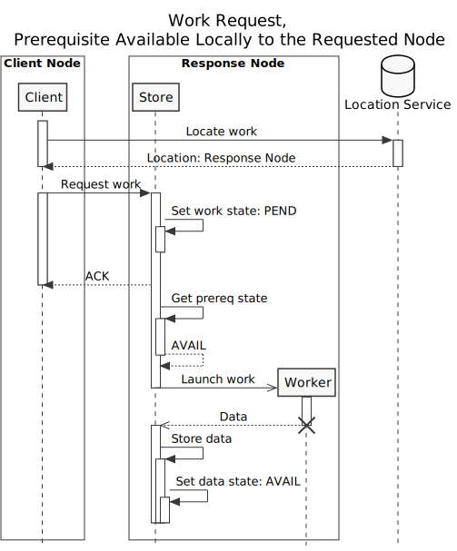
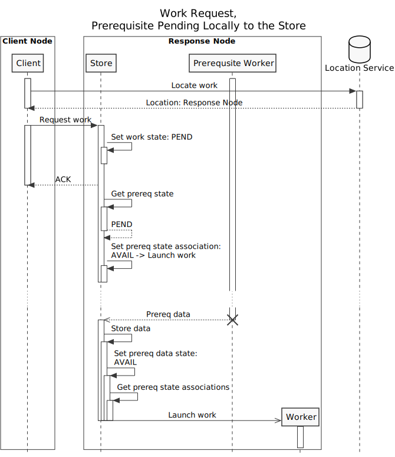
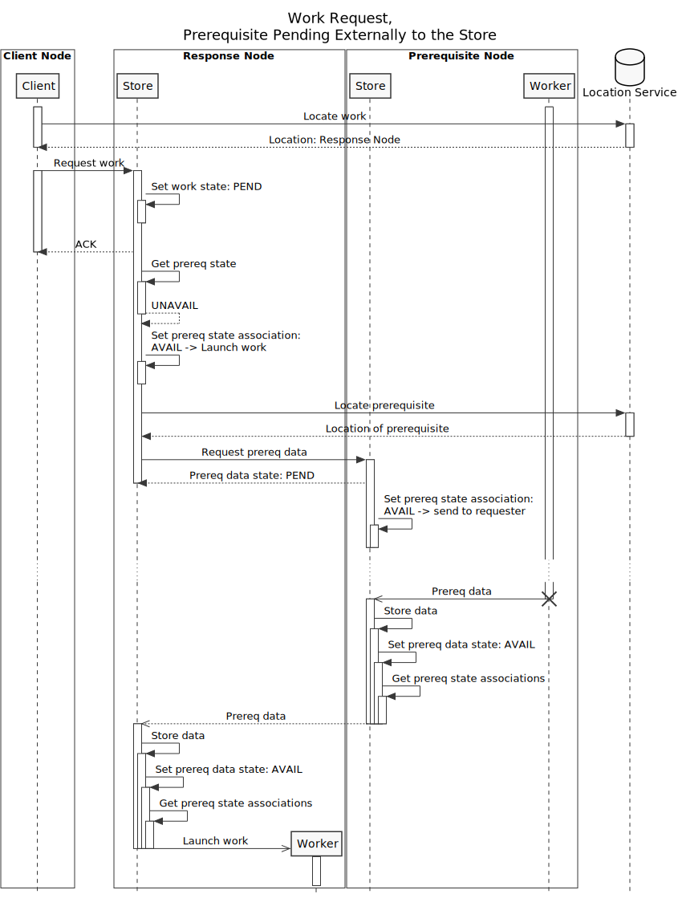

# Introduction

The diagrams in this report depict the principal models of communication in the largerscale system.
Implementation has taken place in the largerscale git repository.
The following gives the structure of the repository:

# Node Initialisation

# Work Request

## Prerequisite Locally Available

## Prerequisite Locally Pending

## Prerequisite Externally Pending

