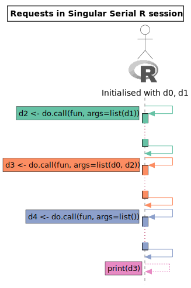
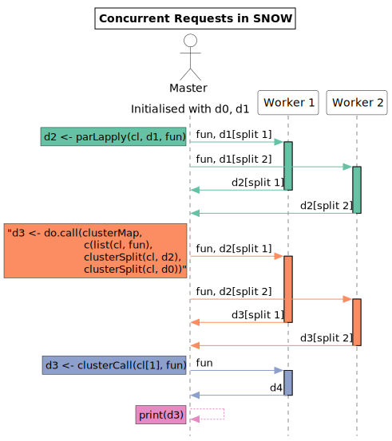
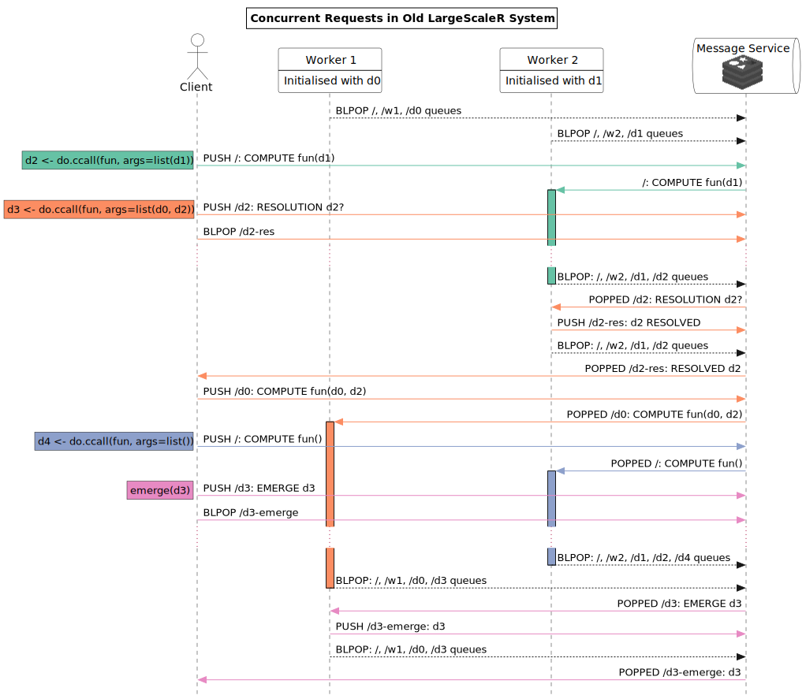
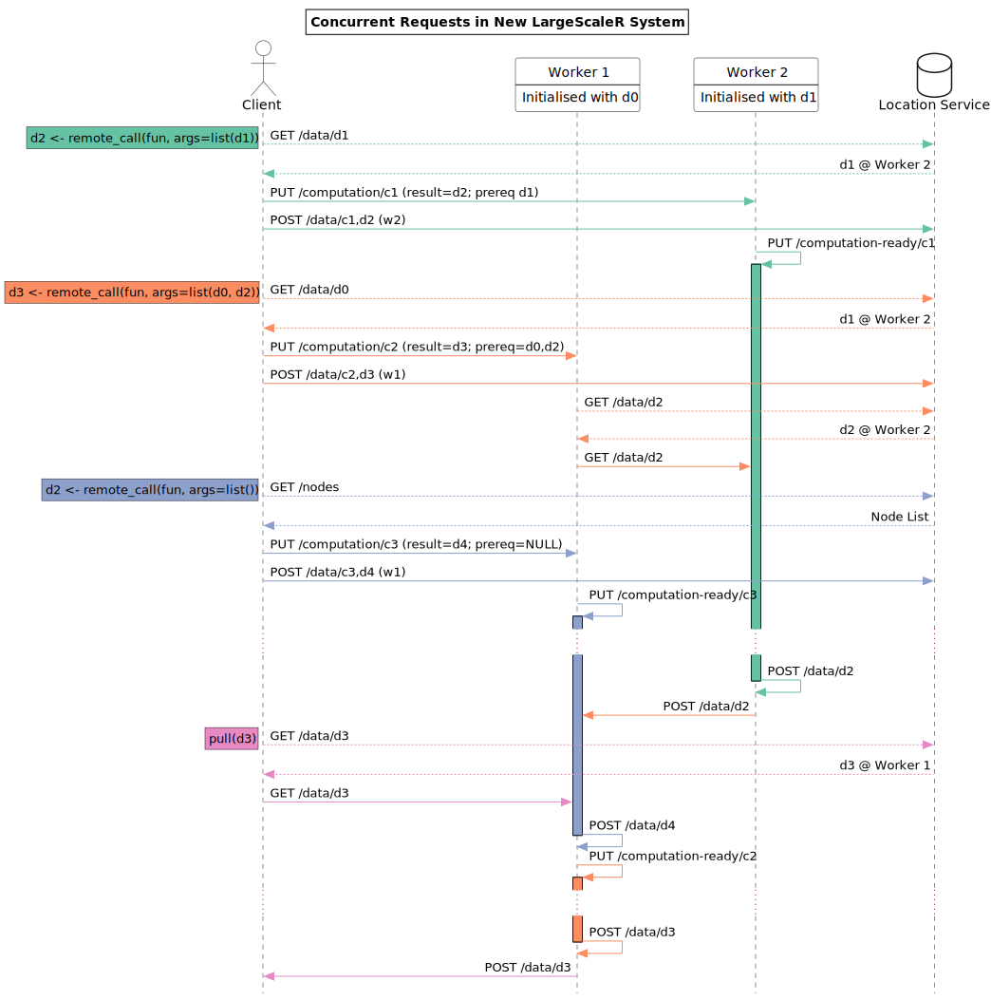

# Introduction

This is an expansion of the previous report, demonstrating a standard sequence of work that may take place in the system.
The sequence is compared among equivalents over a in a single R process, SNOW, the previous version of largescaler, and the current largescaler version.
The work sequence consists of three calls and an examination, with each call having varied prerequisite arguments.

A topologically sorted graph of arguments for the calls is given in [@fig:workseq].

{#fig:workseq}

# Single, serial R session

In a single R session, using no extra parallel features, the work must be done in order, waiting for the prior process to finish before the next may begin.
Examination of data is trivial, as it already exists in the memory of the main R process.

An example session is given in [@fig:rsesswork].
It can be seen that this depiction is the only possible ordering for this work, following the given ordering constraints.

{#fig:rsesswork}

# SNOW

SNOW makes use of additional worker sessions - these may be separate nodes or different processes on the same machine.
Work is split into chunks from a master session, and distributed across workers.
The workers in parallel perform their computations, and send the work back to the master, which was blocking until the work had been received.
In this manner, discrete pieces of work must operate serially, waiting for the previous work to finish and the master to collect the chunks, before sending out new work.
A further point is that the data is regularly ferrying back and forth from master to worker and back, so only reductive computations are able to be made use of for large datasets.

An example session is given in [@fig:snowseq].
The data doesn't have to be split up, but it is more efficient to take advantage of the parallelisation afforded by multiple nodes operating simultaneously.
Like the single serial R session, examination of `d3` is trivial, as it is stored in the master node's memory.

{#fig:snowseq}

# Previous largescaler

The previous largescaler depended closely on a central message service, using redis.

Each chunk of data had a dedicated queue in the message server, which nodes holding the data "subscribed" to.
Nodes also had their own dedicated node queues, as well as listening on the "root" queue, which was accessed by all nodes.
The standard routine for a node was to run a blocking pop over all queues they subscribed to, then when a message was available for them it would be popped from the corresponding queue.
In this way, multiple nodes may be popping over the same queue, and if some nodes are busy while one is available, the available node will take the work, yielding a co-operative scheduling system.

A benefit over SNOW is that computations can run asynchronously - a computation can be fired out and work can continue on the master node without waiting for a result.
Furthermore, as data is persisted over nodes, intuitive programming can take place, and data movement is minimised.

A downside with the old system, not entirely visible from only the interactions is that with a lack of concurrency, worker nodes were unable to put aside computations while waiting on prerequisites.
As such, resolution of computations had to be confirmed by the client node before sending out new computations.
This was the pragmatic response to race conditions described in the [async resolution monitoring report](async-res-monitor.html).

An example session is given in [@fig:oldsysseq].

{#fig:oldsysseq}

# New largescaler

The new system, best described in [the previous descriptive report](architecture.html), does away with the redis queues.
An interim system based on zeroMQ was found to support the hypothesis that direct messaging is sufficient, though each node requires it's own work queues.
The system as it stands is self-sufficient, with orcv providing the queue support.
A location service is needed in place of a message service, in order to inform the routing of messages and requests.
This form is also able to delay the action of computations, thereby enabling some measure of high-level concurrency.
This delay allows for the system to continue with computations along the work graph without a master needing to check for resolution of prerequisites, thereby eliminating a concept that was already difficult to get right.
Furthermore, workers communicate almost entirely amongst themselves in order to attain data and solve computations, creating a more resiliant system.

An example session is given in [@fig:sysinteract].
The session demonstrates overlap and delay in computations, as well as data transferred in peer fashion among worker nodes.
There is significant back-and-forth between the client and locator service for the purpose of locating the addresses of chunks - this only reflects the reality of the current system; it is conceivably cached away, making most of the communication unnecessary.
The diagram has these points of communication shown with dotted lines to illuminate this point.
The demonstration is also non-optimal in order to show the data transfer; if the `d3` computation was sent to Worker 2 instead of worker 1, there would be no delay, and the computations would be completed in the most efficient order possible.
This does hint at some degree of synthesis with the previous largescaler, for scheduling optimisation.

{#fig:sysinteract}
