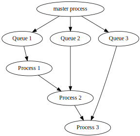
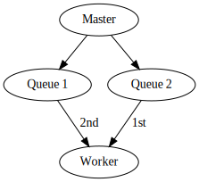

# Introduction

A `Reduce()`{.R}, commonly known as a *fold*, is a computational operation evaluating a binary operation sequentially along a container of objects [@bird2010pearls].
For example, in the case of a `+` operation over a list of values drawn from $\mathbb{R}$, it is equivalent to a cumulative sum.
The `Reduce()`{.R} is provided in the base R distribution as part of the *funprog* group of common higher-order functions.
It serves as a standard means of performing a rolling operation over some container without resorting to explicit looping.
The functional programming paradigm in turn makes heavy use of `Reduce()`{.R} for the succinct encapsulation of the concept.
The `Reduce` referred to in the `MapReduce` paradigm is a similar, though distinct, operation, serving closer to a grouped summary [@dean2004mapreduce].
The `MapReduce` is thus able to stay largely embarrassingly parallel, while a `Reduce()`{.R} is necessarily serial.

# Distributed Reduce

To create a distributed reduce using the *largeScaleR* system is actually mostly solved by the design of distributed objects, which can be passed to the existing `Reduce()`{.R} function as provided in base R, with no further modification.
The only additional effort is to ensure that the operant binary function is capable of operating on distributed objects.
This can be guaranteed by making use of a `dreducable()`{.R} wrapper functional around a regular function, which returns the original function modified to operate in distributed fashion.
The source code demonstrating this is given in [@lst:dreduce].

```{#lst:dreduce .R caption="The wrapper functional providing a distributed reduce showing the very little effort required to generate a distributed reduce from the framework"}
dreduce <- function(f, x, init, right = FALSE, accumulate = FALSE, ...) {
	Reduce(dreducable(f, ...), chunkRef(x), init, right, accumulate)
}

dreducable <- function(f, ...) {
	function(x, y) {
		do.ccall(f, list(x, y), target = y, ...)
	}
}
```

The `dreducable()`{.R} function is itself a simple wrapper around the `do.ccall()`{.R} function that serves to power all of the *largeScaleR* distributed object operation requests.

# Description of Program Flow

The program flow of a standard distributed reduce is depicted in [@fig:dreduce].

{#fig:dreduce}

Assuming a distributed object split consecutively over processes 1, 2, and 3, with a single master node containing the reference to this object, a distributed reduce takes place as follows:

1. Upon invocation of the distributed reduce, the master sends requests to all queues associated with the chunks composing the distributed object.
   These requests contain (unresolved) references to the chunks resulting from the distributed reduce, alongside the function to be performed over them.
   As these chunk references are not yet resolved, the processes popping the requests from the queues will block, except for the initial queue, which should be only referencing resolved chunks.
   The master process continues processing asynchronously, only blocking when the result of the distributed reduce operation is requested.
2. The process containing the initial chunk operates over it and stores the output. It then continues reading queues and processing as before, with it's role in distributed reduce being complete.
3. The second process is now able to access the previously unresolved chunk reference, and emerges it directly from the first process.
   It operates on the chunks, storing the output.
4. This repeats until all processes have completed the requests initially given by the master process.
5. When needed, the master may emerge the resulting object, with either cumulative steps given by all processes, or only the end result, depending on the options provided.
   The distributed reduce is complete.

# Applications and Challenges

The applications for a distributed reduce correspond closely to those of a regular reduce.
Any "rolling" or windowed function that bases it's state on some form of previous elements in a list is able to take clear representation through a distributed reduce.

Of particular interest are updating modelling functions.
Representative of this class of statistical algorithm is *biglm*, with an eponymously named package available in R.
A prototype distributed linear model making use of both the *biglm* and *largeScaleR* packages is described in detail in the distributed linear model document.

Though serving as a powerful high-level construct, it is hindered at present by the current state of the *largeScaleR* mechanism of managing unresolved references.
As it currently stands, when a process receives a request from a queue involving a reference that has not yet been computed (unresolved), it sits and blocks until that the chunk has been resolved.
A very simple race condition emerges when the process has two requests simultaneously, one dependent on another, and pops the request with dependency.
This request can never be serviced, as it will block, thereby never allowing the request providing the dependency to run.
Such a race condition manifests in a distributed reduce if a process holds two or more chunks to be reduced over -- there is a single line of dependence between them and their resultant chunks.
Furthermore, as the nature of popping from multiple queues is for all intents random, such a race condition is non-deterministic and difficult to reproduce.
[@lst:dreduce-race] gives a setup where roughly half the time a race condition as described occurs, and the program hangs until forced termination, with illustration provided in [@fig:dreduce-rc].

```{#lst:dreduce-race .R caption="Example potential for a race condition in the distributed reduce"}
library(largeScaleR)
start(workers=1)

chunks <- distribute(1:2, 2)
dreduce("sum", chunks)
```

{#fig:dreduce-rc}

Solutions to such a problem are forthcoming, with the chosen solution likely serving as a key architectural component.
