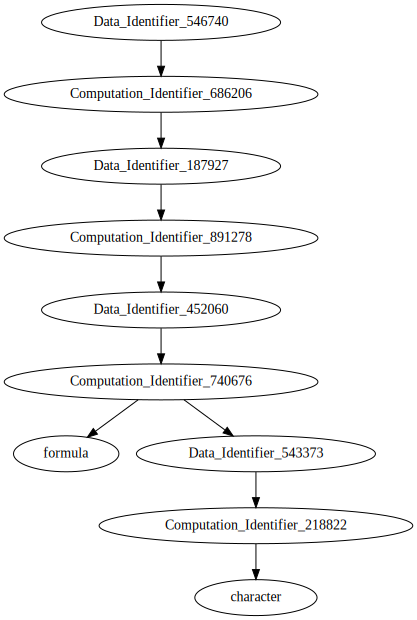

# Introduction

This is a [brief demonstration](https://github.com/jcai849/largerscale/blob/b3bd66fd42f2d4b984026c280298dc8e7c943492/demo/general.Rmd) of the main actors used in the largerscale
system, with emphasis on their structure and use. The motivation behind
these is given in other documents. This demonstration emulates two
machines; one local to the user, and one remote worker session.

## LOCAL MACHINE

The largerscale library is initiated and data is read in from
(imaginary) HDFS. The `read.hdfs()`{.R} function produces a computation
object internally, and sends it to the remote worker, which operates
based on the computation, creating some remote data output (shown in the
next section). The function returns a data object locally that operates
as a proxy to the remote data.

```{.R}
    library(largerscale)

    dfdata <- read.hdfs("/some/file/path")
    str(dfdata)
```

```
    ## Data:
    ## Identifier: Identifier:  543373  
    ## Computation Identifier: Identifier:  218822
```

## REMOTE MACHINE

The remote machine has a new computation added to it’s computation pool,
which may serve as a more general work queue. It `receive()`{.R}s the
computation from the pool, and then performs the computation, which
produces a fixed data object. Note that the fixed data object has a
value. The computation and the data object are added to the remote
machine’s datapool.

```{.R}
    (computationqueue())
```

```
    ## Queue: 1 Elements
```

```{.R}
    (dfcomp <- receive())
```

```
    ## Computation Identifier 218822
```

```{.R}
    str(dfcomp)
```

```
    ## Computation:
    ## Identifier: Identifier:  218822  
    ## Input:   List of 1
    ##    $ : chr "/some/file/path"
    ## Value: function (path)   
    ## Output: Identifier:  543373
```

```{.R}
    (computationqueue())
```

```
    ## Queue: 0 Elements
```

```{.R}
    str(do(dfcomp))
```

```
    ## 'data.frame':    100 obs. of  2 variables:
    ##  $ y: int  1 2 3 4 5 6 7 8 9 10 ...
    ##  $ x: int  1 2 3 4 5 6 7 8 9 10 ...
```

```{.R}
    (datapool())
```

```
    ## Pool: 2 Items
```

```{.R}
    str(datapool())
```

```
    ## Pool: 2 Items 
    ##   218822 : Computation:
    ##   Identifier: Identifier:  218822  
    ##   Input:   List of 1
    ##      $ : chr "/some/file/path"
    ##   Value: function (path)   
    ##   Output: Identifier:  543373  
    ##   543373 : Identifier: Identifier:  543373  
    ##   Value:   'data.frame': 100 obs. of  2 variables:
    ##      $ y: int  1 2 3 4 5 6 7 8 9 10 ...
    ##      $ x: int  1 2 3 4 5 6 7 8 9 10 ...
    ##   Computation: Identifier:  218822
```

## LOCAL MACHINE

Concurrently at the local machine, the `value` of the data may be
requested. From the data `identifier`, it is located, and the remote
machine sends it directly. Here it is available immediately, but it
could very well block or respond with non-availability if it is still
being processed. In this case, what was “read” from HDFS is a data
frame, as shown in the `str()`{.R} result A linear model is requested to be
fit on this data, using the `data` object and a formula.

```{.R}
    str(df <- value(dfdata))
```

```
    ## 'data.frame':    100 obs. of  2 variables:
    ##  $ y: int  1 2 3 4 5 6 7 8 9 10 ...
    ##  $ x: int  1 2 3 4 5 6 7 8 9 10 ...
```

```{.R}
    (lmdata <- do(lm, list(y ~ x, data=dfdata)))
```

```
    ## Data Identifier 452060
```

## REMOTE MACHINE

Again, the remote machine `receive()`{.R}s the computation, `do()`{.R}es it, and
adds the results to the datapool.

```{.R}
    (lmcomp <- receive())
```

```
    ## Computation Identifier 740676
```

```{.R}
    invisible(do(lmcomp))
    (datapool())
```

```
    ## Pool: 4 Items
```

## LOCAL MACHINE

A summary is run on the result, without waiting for any value to be
returned.

```{.R}
    (sdata <- do(summary, lmdata))
```

```
    ## Data Identifier 187927
```

## REMOTE MACHINE

As before - this is a loop that would run continuously

```{.R}
    (scomp <- receive())
```

```
    ## Computation Identifier 891278
```

```{.R}
    invisible(do(scomp))
    (datapool())
```

```
    ## Pool: 6 Items
```

## LOCAL MACHINE

The value of the summary is requested. The call capture issue, as given
in another document, rears it’s head, but is `NULL`ed here for
simplicity. The `coef()`{.R}ficients of the summary are requested.

```{.R}
    s <- value(sdata)
    s[1] <- NULL # get rid of call capture !!
    (s)
```

```
    ## 
    ## Call:
    ## NULL
    ## 
    ## Residuals:
    ##        Min         1Q     Median         3Q        Max 
    ## -2.680e-13 -4.300e-16  2.850e-15  5.302e-15  3.575e-14 
    ## 
    ## Coefficients:
    ##               Estimate Std. Error    t value Pr(>|t|)    
    ## (Intercept) -5.684e-14  5.598e-15 -1.015e+01   <2e-16 ***
    ## x            1.000e+00  9.624e-17  1.039e+16   <2e-16 ***
    ## ---
    ## Signif. codes:  0 '***' 0.001 '**' 0.01 '*' 0.05 '.' 0.1 ' ' 1
    ## 
    ## Residual standard error: 2.778e-14 on 98 degrees of freedom
    ## Multiple R-squared:      1,  Adjusted R-squared:      1 
    ## F-statistic: 1.08e+32 on 1 and 98 DF,  p-value: < 2.2e-16
```

```{.R}
    (cdata <- do(coef, sdata))
```

```
    ## Data Identifier 546740
```

## REMOTE MACHINE

The remote machine repeats the evaluation loop

```{.R}
    (ccomp <- receive())
```

```
    ## Computation Identifier 686206
```

```{.R}
    (do(ccomp))
```

```
    ##                  Estimate   Std. Error       t value     Pr(>|t|)
    ## (Intercept) -5.684342e-14 5.598352e-15 -1.015360e+01 5.618494e-17
    ## x            1.000000e+00 9.624477e-17  1.039018e+16 0.000000e+00
```

## LOCAL MACHINE

Given that all of the computations and data keep track of the
identifiers of their dependencies, an abstract dependency graph exists.
This graph does not (and should not) exist literally, but in the case of
machine failure, with replication of the computation objects and some
data objects, the data can be recreated. Here we compile the abstract
dependency graph to DOT notation.

```{.R}
    dependencygraph(cdata)
```

```
    ## digraph G {
    ## Data_Identifier_546740  ->  Computation_Identifier_686206 ;
    ## Computation_Identifier_686206  ->  Data_Identifier_187927 ;
    ## Data_Identifier_187927  ->  Computation_Identifier_891278 ;
    ## Computation_Identifier_891278  ->  Data_Identifier_452060 ;
    ## Data_Identifier_452060  ->  Computation_Identifier_740676 ;
    ## Computation_Identifier_740676  ->  " formula " ;
    ## Computation_Identifier_740676  ->  Data_Identifier_543373 ;
    ## Data_Identifier_543373  ->  Computation_Identifier_218822 ;
    ## Computation_Identifier_218822  ->  " character " ;
    ## }
```

And display it visually with graphviz

```{.R}
    gpath <- tempfile(fileext=".svg")
    g <- pipe(paste0("dot -Tsvg >", gpath))
    capture.output(dependencygraph(cdata), file=g)
```


