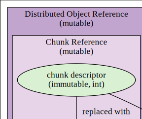
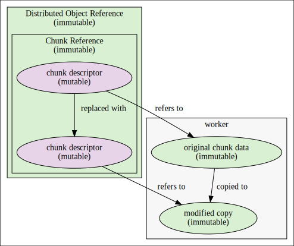

# Problem

With the introduction of chunk deletion in *largeScaleR*, an efficient means of mutability emulation opens up.
Taking the replacement operation as an example of modification, given in R as `$<-`{.R}, a distributed chunk may be modified through creating a copy of the data on the worker holding it, then performing the modification on that copy, and replacing the master reference to the original chunk with one to the modified copy; if there are no more references to the original, garbage collection will trigger a deletion of the distributed chunk, thereby preventing memory leaks.
This operation is depicted as a diagram in [@fig:modifyref].

{#fig:modifyref}

A significant benefit of this emulation of mutability is that chunk descriptors will always refer to the same version of the data, which has major ramifications for the integrity of future redundancy features - reference objects such as environments excluded.

As currently implemented, the final step of replacing the master reference to a modified copy is not possible to take place in a manner maintaining a transparent representation of standard (immutable) R objects.
This is due to references themselves being implemented as mutable, so changes to any shallow copy of a reference is reflected among all shallow copies of that reference.
An illustration is given in the context of local variables, with [@lst:mutability-expected.R] giving an example R session of expected behaviour, and [@lst:mutability-actual.R] displaying the actual behaviour.

```{#lst:mutability-expected.R .R caption="Expected result of object modification."}
> x <- distribute(mtcars)
> x$mpg <- 1
> emerge(x$mpg)
 [1] 1 1 1 1 1 1 1 1 1 1 1 1 1 1 1 1 1 1 1 1 1 1 1 1 1 1 1 1 1 1 1 1
{ function(x) { x$mpg <- 2; emerge(x$mpg) }(x)
 [1] 2 2 2 2 2 2 2 2 2 2 2 2 2 2 2 2 2 2 2 2 2 2 2 2 2 2 2 2 2 2 2 2
> emerge(x$mpg)
 [1] 1 1 1 1 1 1 1 1 1 1 1 1 1 1 1 1 1 1 1 1 1 1 1 1 1 1 1 1 1 1 1 1
```

```{#lst:mutability-actual.R .R caption="Current result of object modification."}
> x <- distribute(mtcars)
> x$mpg <- 1
> emerge(x$mpg)
 [1] 1 1 1 1 1 1 1 1 1 1 1 1 1 1 1 1 1 1 1 1 1 1 1 1 1 1 1 1 1 1 1 1
{ function(x) { x$mpg <- 2; emerge(x$mpg) }(x)
 [1] 2 2 2 2 2 2 2 2 2 2 2 2 2 2 2 2 2 2 2 2 2 2 2 2 2 2 2 2 2 2 2 2
> emerge(x$mpg)
 [1] 2 2 2 2 2 2 2 2 2 2 2 2 2 2 2 2 2 2 2 2 2 2 2 2 2 2 2 2 2 2 2 2
```

# Proposed Solution

This behaviour can be led to an acceptable change by inverting the mutability of distributed object references and their contents, as depicted in Figure [@fig:modifyrefprop].

{#fig:modifyrefprop}

This forces on-modify copies of the distributed objects when they are used as local variables, thereby keeping changes to them local to a particular scope.
What isn't copied is the descriptor, which is now mutable.
The mutability isn't essential for any attributes other than connection to R's garbage collector, which can only be explicitly registered to collect mutable objects such as environments or external pointers.
The modification maintains the same conceptual flow of mutability emulation, including a replacement of the descriptor, rather than modification.
As it currently stands, there is no *largeScaleR* dependency on mutable distributed object references, so there are no changes to be made in that respect.
